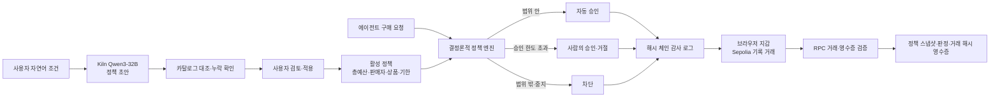

# AgentGuard 아키텍처와 3분 데모

## 한 문장 설명

사용자가 AI 에이전트에게 구매를 위임하더라도, AgentGuard가 지출 한도를 코드로 강제하고 사람의 승인과 테스트넷 기록을 연결해 나중에 허가 범위를 검증할 수 있게 합니다.

## 시스템 흐름

AI는 자연어를 구조화합니다. 구매 허용 여부는 LLM 응답으로 정하지 않고 정책 엔진이 계산합니다. 판매자와 상품은 카탈로그에 대조합니다. 문장에 없는 자동 승인 한도와 기한은 사용자가 직접 확인해야 합니다. 총예산은 같은 정책 버전에서 이미 지출한 금액과 승인 대기 중 예약된 금액까지 포함합니다.

테스트넷에는 앱 감사 체인의 마지막 SHA-256 해시를 자기 주소로 보내는 0 ETH 거래 데이터에 기록합니다. 서버는 Sepolia RPC가 반환한 거래와 영수증을 재조회해 일치하는 거래만 앱 기록에 연결합니다. 실제 결제는 이 데모에 포함되지 않습니다.

## 리허설 입력과 기대 결과

새 정책을 적용한 뒤 다음 순서로 실행합니다. 이전 버전의 지출·감사 기록은 보존됩니다.

| 순서 | 조작 | 기대 결과 |
|---|---|---|
| 1 | `승인된 판매자에서 게이밍 모니터를 30만원 이내로 구매해.` 입력 후 초안 만들기 | `gaming_monitor`, DisplayHub·TechStore, 예산 300,000원. 자동 승인 한도와 기한은 확인 필요 |
| 2 | 자동 승인 한도 270,000원, 기한 내일로 설정 후 적용 | 새 정책 버전 생성, 잔여 총예산 300,000원 |
| 3 | TechStore의 299,000원 모니터 요청 | 승인 대기, 299,000원 예약 |
| 4 | 사람이 요청 거절 | 예약 해제, 지출 0원, 거절 기록 |
| 5 | UnlistedMarket의 219,000원 모니터 요청 | 미등록 판매자 차단 기록 |
| 6 | DisplayHub의 249,000원 모니터 요청 | 자동 승인, 사용액 249,000원 |
| 7 | 같은 모니터에 수수료 60,000원을 더해 재요청 | 총예산 초과 차단 기록 |
| 8 | 지출 위임 중지 후 구매 재요청 | 위임 중지로 차단 기록 |
| 9 | 영수증 확인, Sepolia 해시 기록·거래 검증 | 정책 스냅샷, 판정 이벤트, 실제 거래 해시가 연결됨 |

9번은 Kiln API 자격 증명, Sepolia RPC, 브라우저 지갑과 테스트넷 ETH가 준비된 뒤 실제로 수행해야 합니다. 준비 전에는 화면에 `측정 안 됨` 또는 `아직 연결되지 않음`으로 표시됩니다.

## 발표 대본 초안

**0:00–0:30** “AI에게 구매를 맡기면 결제 기록만으로는 사용자가 얼마까지, 어디에서 사라고 했는지 알기 어렵습니다. AgentGuard는 위임 조건을 지출 직전에 검사하고 그 근거를 남깁니다.”

**0:30–1:05** “게이밍 모니터를 30만원 이내로 사라고 입력합니다. Kiln의 `Qwen3-32B`가 상품과 판매자 후보를 정책 초안에 채웁니다. 말하지 않은 자동 승인 한도와 기한은 사용자가 확인합니다.”

**1:05–1:55** “299,000원 상품은 승인 대기입니다. 거절하면 예약액이 풀립니다. 미등록 판매자는 차단됩니다. 249,000원 상품은 허용되지만, 다음 요청은 수수료와 앞선 지출을 합쳐 총예산을 넘으므로 차단됩니다.”

**1:55–2:25** “사용자가 위임을 중지하면 이후 요청도 차단됩니다. 영수증에는 요청 당시 정책과 판정·승인 기록이 있어 제3자가 허가 범위를 재구성할 수 있습니다.”

**2:25–3:00** “감사 체인의 해시를 Sepolia 거래 데이터에 기록하고 거래 해시를 영수증에 연결합니다. 정책 해석의 실제 입력·출력 토큰은 API 응답에서 측정하고, 매 구매 판정은 추가 추론 없이 코드로 실행합니다.”

발표 당일에는 실제 측정 토큰 수, 거래 해시, 체인 탐색기 화면을 넣습니다. 이 값이 없으면 성공 사례로 말하지 않습니다.
